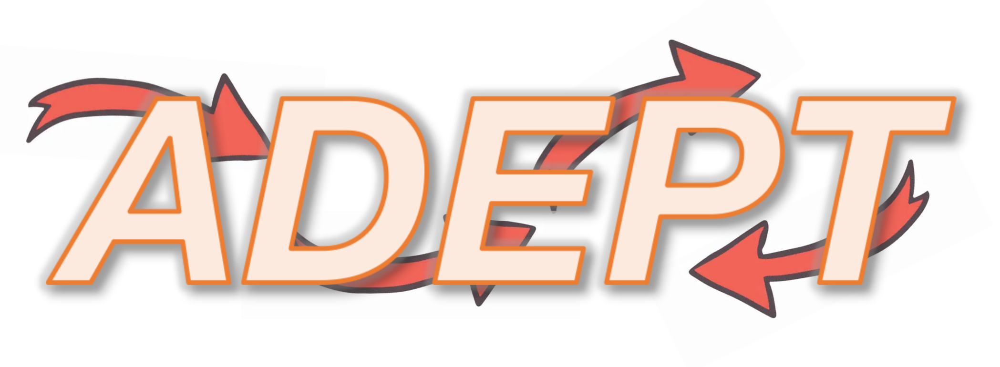
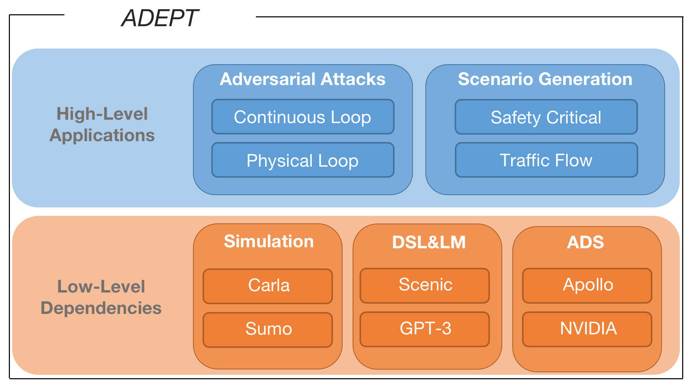
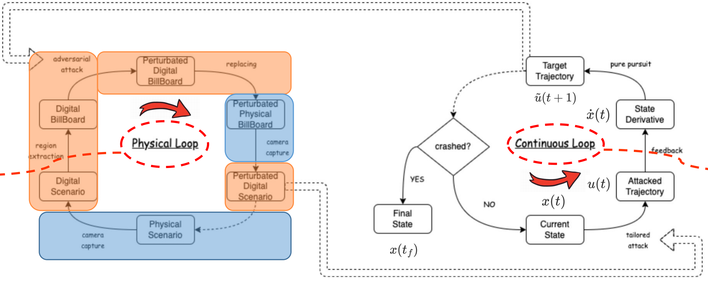

***

Welcome to ADEPT's GitHub page!

[ADEPT](https://github.com/strivin0311/ADEPT): A Testing Platform for Autonomous Driving System

## Table of Contents

1. [Introduction](#introduction)
2. [Prerequisites](#prerequisites)
3. [Architecture](#architecture)
4. [Installation](#installation)
5. [Quick Starts](#quick-starts)
6. [Documents](#documents)

## Introduction

ADEPT is a testing platform for Autonomous Driving System, on which we are dedicating ourselves to research on ADS Quality and Safety, and you can make your own contribution through our platform with convenient, high-level API in ADEPT's Python packages

## Prerequisites

* Autonomous Driving System:
* ADS Safety:
* ADS Testing:
* Carla:
* Sumo:
* Scenic:
* Apollo:

## Architecture

*  ADEPT Overview:

* Physical-Continuous Closed Loop Overview:

## Installation

* Carla Installation:
* Sumo Installation:
* Apollo Installation:

## Quick Starts

* Example 1: Path Hijacking with Adversarial Attack in Physical-Continuous Closed Loop
* Example 2: Scenario Generation with Accident Reports
* Example 3: Traffic Flow Generation with Carla-Sumo Co-Simulation

## Documents

* [Adept Python API reference](waiting...)
* [WeCam Virtual Camera Installation Guide](docs/guide/WeCam%20virtual%20camera%20installation%20guide.pdf)

* [ADEPT ASE2022 Tool Demo paper](https://cs.nju.edu.cn/yuanyao/static/asedemo2022.pdf)

* [Physical-Continuous Closed Loop paper](waiting...)
